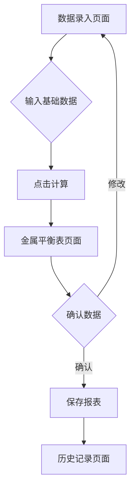

## 1. 产品概述
选矿日报表系统是一个基于Web的生产数据管理工具，用于录入和计算选矿过程中的金属平衡数据。系统帮助选矿厂工作人员快速录入生产数据，自动生成金属平衡表，提高生产数据统计效率和准确性。

## 2. 核心功能

### 2.1 用户角色
| 角色 | 注册方式 | 核心权限 |
|------|----------|----------|
| 操作员 | 管理员分配账号 | 录入生产数据、查看报表 |
| 管理员 | 系统初始化创建 | 管理用户、查看所有报表、导出数据 |

### 2.2 功能模块
本系统包含以下主要页面：
1. **数据录入页面**：班次信息、原矿数据、精矿数据输入表单。
2. **金属平衡表页面**：自动计算并显示干量、金属量、产率、回收率等指标。
3. **历史记录页面**：查看和导出历史报表数据。

### 2.3 页面详情
| 页面名称 | 模块名称 | 功能描述 |
|----------|----------|----------|
| 数据录入页面 | 班次信息 | 选择班次（早班/中班/晚班）、录入日期时间。 |
| 数据录入页面 | 原矿数据 | 输入湿量、水分、品位（Au、Ag、Cu、Pb、Zn等）。 |
| 数据录入页面 | 精矿数据 | 输入精矿湿量、水分、各金属品位。 |
| 数据录入页面 | 计算按钮 | 点击后自动计算金属平衡指标。 |
| 金属平衡表页面 | 平衡表显示 | 以表格形式展示干量、金属量、产率、回收率。 |
| 金属平衡表页面 | 数据验证 | 显示计算过程中的异常提示。 |
| 历史记录页面 | 记录列表 | 按日期筛选查看历史报表记录。 |
| 历史记录页面 | 导出功能 | 支持导出Excel格式的报表。 |

## 3. 核心流程
用户操作流程：
1. 用户进入数据录入页面，选择班次和日期。
2. 输入原矿的湿量、水分数据，系统自动计算干量。
3. 输入各金属元素的品位数据。
4. 输入精矿的湿量、水分和品位数据。
5. 点击计算按钮，系统自动生成金属平衡表。
6. 在金属平衡表页面查看计算结果，确认无误后保存。
7. 可在历史记录页面查看和导出历史数据。

## 4. 用户界面设计

### 4.1 设计风格
- **主色调**：深蓝色（#1e40af）代表矿业专业性，辅以白色背景。
- **按钮样式**：圆角矩形，主要操作为实心蓝色按钮，次要操作为边框按钮。
- **字体**：中文使用思源黑体，数字使用Roboto Mono等宽字体便于对齐。
- **布局风格**：卡片式布局，每个数据录入区域独立成卡片。
- **图标风格**：使用简洁的线性图标，如矿石、计算器等主题图标。

### 4.2 页面设计概述
| 页面名称 | 模块名称 | UI元素 |
|----------|----------|--------|
| 数据录入页面 | 表单区域 | 左侧为输入表单，右侧为实时预览；输入框带单位标签（吨、%、g/t）。 |
| 金属平衡表页面 | 表格显示 | 采用斑马纹表格，重要指标（回收率）用绿色高亮显示异常值用红色警示。 |
| 历史记录页面 | 记录列表 | 日期选择器在顶部，记录以卡片形式展示，包含关键指标摘要。 |

### 4.3 响应式设计
- 采用桌面优先设计，主界面适合1440px以上宽度显示。
- 平板端适配1024px宽度，表格可横向滚动。
- 移动端提供简化版本，主要功能为数据录入和查看最新报表。