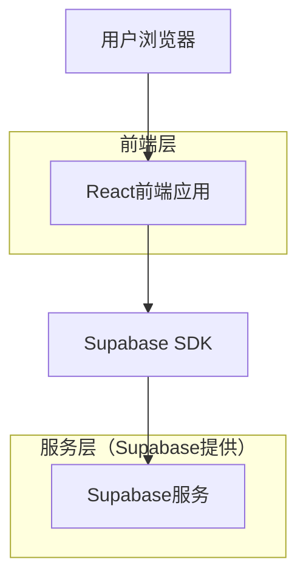
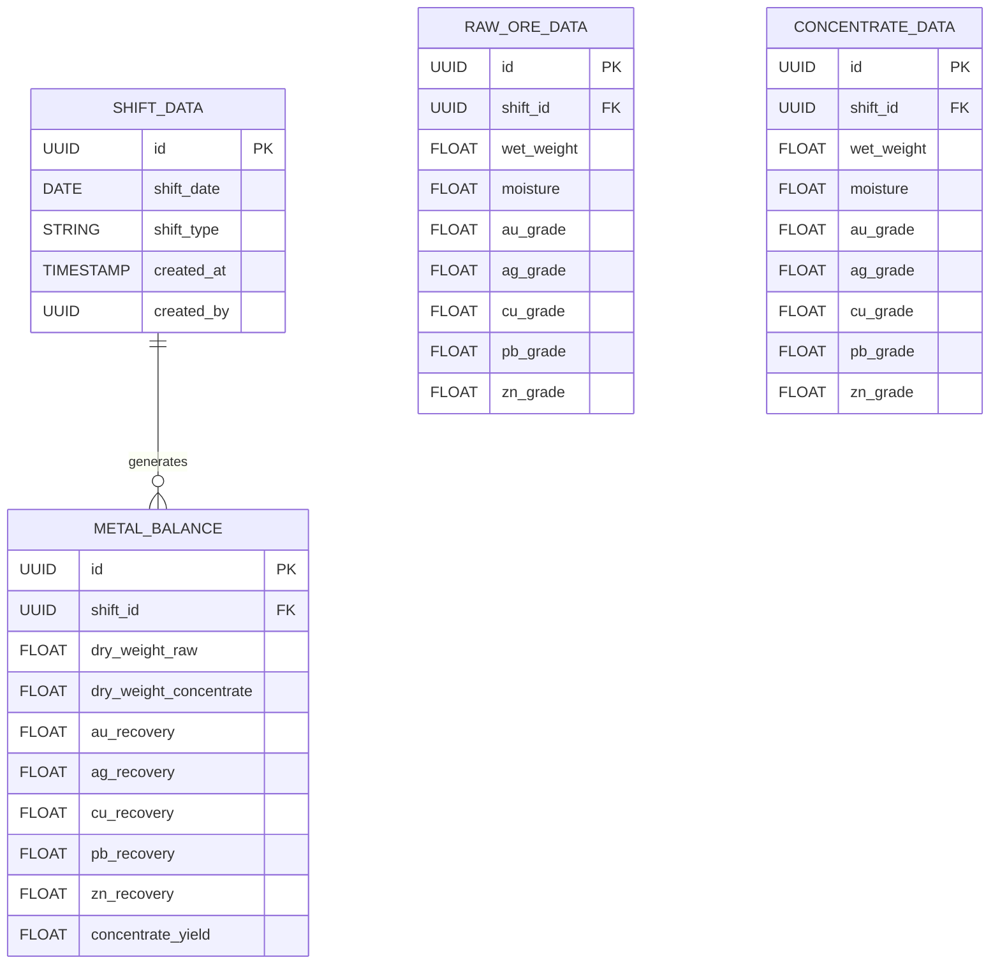

## 1. 架构设计



## 2. 技术描述

- 前端：React@18 + tailwindcss@3 + vite
- 初始化工具：vite-init
- 后端：Supabase（PostgreSQL数据库）
- 主要依赖：
  - @supabase/supabase-js（数据库操作）
  - react-hook-form（表单管理）
  - date-fns（日期处理）
  - lucide-react（图标库）

## 3. 路由定义

| 路由 | 用途 |
|------|------|
| / | 数据录入页面，主要的数据输入界面 |
| /balance | 金属平衡表页面，显示计算结果 |
| /history | 历史记录页面，查看历史报表 |
| /login | 登录页面，用户身份验证 |

## 4. 数据模型

### 4.1 数据模型定义



### 4.2 数据定义语言

班次数据表 (shift_data)
```sql
-- 创建班次数据表
CREATE TABLE shift_data (
    id UUID PRIMARY KEY DEFAULT gen_random_uuid(),
    shift_date DATE NOT NULL,
    shift_type VARCHAR(10) NOT NULL CHECK (shift_type IN ('早班', '中班', '晚班')),
    created_at TIMESTAMP WITH TIME ZONE DEFAULT NOW(),
    created_by UUID REFERENCES auth.users(id),
    UNIQUE(shift_date, shift_type)
);

-- 创建原矿数据表
CREATE TABLE raw_ore_data (
    id UUID PRIMARY KEY DEFAULT gen_random_uuid(),
    shift_id UUID REFERENCES shift_data(id) ON DELETE CASCADE,
    wet_weight DECIMAL(10,2) NOT NULL CHECK (wet_weight > 0),
    moisture DECIMAL(5,2) NOT NULL CHECK (moisture >= 0 AND moisture <= 100),
    au_grade DECIMAL(8,4),
    ag_grade DECIMAL(8,4),
    cu_grade DECIMAL(8,4),
    pb_grade DECIMAL(8,4),
    zn_grade DECIMAL(8,4)
);

-- 创建精矿数据表
CREATE TABLE concentrate_data (
    id UUID PRIMARY KEY DEFAULT gen_random_uuid(),
    shift_id UUID REFERENCES shift_data(id) ON DELETE CASCADE,
    wet_weight DECIMAL(10,2) NOT NULL CHECK (wet_weight > 0),
    moisture DECIMAL(5,2) NOT NULL CHECK (moisture >= 0 AND moisture <= 100),
    au_grade DECIMAL(8,4),
    ag_grade DECIMAL(8,4),
    cu_grade DECIMAL(8,4),
    pb_grade DECIMAL(8,4),
    zn_grade DECIMAL(8,4)
);

-- 创建金属平衡表
CREATE TABLE metal_balance (
    id UUID PRIMARY KEY DEFAULT gen_random_uuid(),
    shift_id UUID REFERENCES shift_data(id) ON DELETE CASCADE,
    dry_weight_raw DECIMAL(10,2) NOT NULL,
    dry_weight_concentrate DECIMAL(10,2) NOT NULL,
    au_recovery DECIMAL(5,2),
    ag_recovery DECIMAL(5,2),
    cu_recovery DECIMAL(5,2),
    pb_recovery DECIMAL(5,2),
    zn_recovery DECIMAL(5,2),
    concentrate_yield DECIMAL(5,2),
    created_at TIMESTAMP WITH TIME ZONE DEFAULT NOW()
);

-- 创建索引
CREATE INDEX idx_shift_data_date ON shift_data(shift_date DESC);
CREATE INDEX idx_metal_balance_shift ON metal_balance(shift_id);

-- 设置权限
GRANT SELECT ON shift_data TO anon;
GRANT ALL PRIVILEGES ON shift_data TO authenticated;
GRANT SELECT ON raw_ore_data TO anon;
GRANT ALL PRIVILEGES ON raw_ore_data TO authenticated;
GRANT SELECT ON concentrate_data TO anon;
GRANT ALL PRIVILEGES ON concentrate_data TO authenticated;
GRANT SELECT ON metal_balance TO anon;
GRANT ALL PRIVILEGES ON metal_balance TO authenticated;
```

## 5. 核心计算逻辑

金属平衡计算公式：
- 干量 = 湿量 × (1 - 水分/100)
- 金属量 = 干量 × 品位 / 100
- 回收率 = (精矿金属量 / 原矿金属量) × 100%
- 产率 = (精矿干量 / 原矿干量) × 100%

前端计算服务：
```typescript
interface CalculationResult {
  dryWeightRaw: number;
  dryWeightConcentrate: number;
  metalContent: Record<string, number>;
  recoveryRates: Record<string, number>;
  concentrateYield: number;
}

function calculateMetalBalance(rawData: RawOreData, concentrateData: ConcentrateData): CalculationResult {
  // 计算干量
  const dryWeightRaw = rawData.wetWeight * (1 - rawData.moisture / 100);
  const dryWeightConcentrate = concentrateData.wetWeight * (1 - concentrateData.moisture / 100);
  
  // 计算金属量和回收率
  // ... 详细计算逻辑
}
```